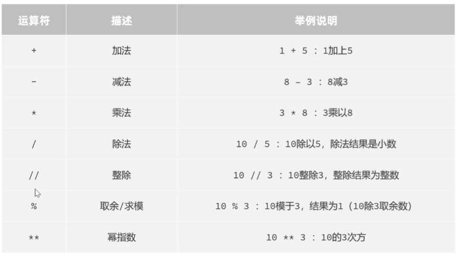

### 字面量与变量以及常见数据类型
字面量（常量）类型：整型（int）、浮点型（float）、布尔型(本质也是整型)（bool）、字符串（str）、空值（None）、数据容器（列表，元组，集合，字典）
type(数据)：输出数据的类型
isinstance(数据，类型)：（bool值），判断数据是否是指定的类型
字符串定义方式：1.单引号 ，2.双引号，3.三引号（多行字符串）
转义字符 （用于输出带引号的字符串）: \'（单引号），\“（双引号）,\n（换行符），\t（制表符（相当于tab缩进））
字符串拼接（3种方式）：
1.用“+”，只能拼接两个字符串，否则需要用str()将其他类型强转为字符串；
“”“
print("大家好，我是"+name+"，我的年龄是"+str(age)+"，我的专业是"+major+"，我喜欢"+hobby)
”“”
2.f"字符串{变量/表达式}"；
"""
print(f"大家好，我是{name}，我的年龄是{age}，我的专业是{major}，我喜欢{hobby}")
"""
3.占位符 "%s" 
"""
print("大家好，我是%s，我的年龄是%s，我的专业是%s，我喜欢%s" % (name,age,major,hobby))
"""
### 输入与输出
s=input("提示信息")的返回值为字符串
### 运算符
#### 算术运算符
优先级：**——>* / // % ——>+ -

