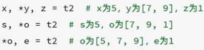
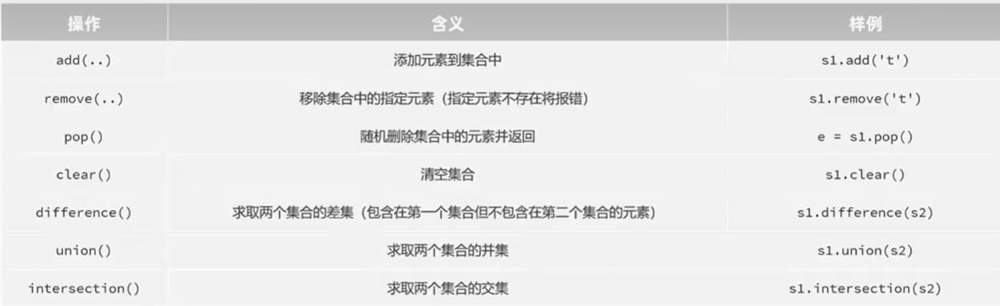

### 列表(list)
#### 介绍
**1. 列表的定义方式及特点**
- 列表名=\[元素1,元素2,元素3\]
- 可以存放不同类型元素、可重复、有序、元素,可以修改
**2. 列表的索引**
- 正向索引:从0开始
- 反向索引:从-1开始
**3. 列表元素的查看、修改、删除**
- 查看:list1\[0\]
- 修改:list1\[0\]="A"
- 删除:del list1\[3\]
	注意:如果指定的索引值超出范围,将会报错
**4. 列表的切片**
- 语法:s1=s\[start:end:step\]
- 特点:
	start:开始索引,不指定默认为0(第一个元素的索引)
	end:结束索引,不指定默认列表末尾(不包括该索引)
	step:步长,不指定默认为1
	提示：
		1.后一个冒号可以省略，前一个不可以;
		2.step可以为负数，表示从后往前切片，此时start和end的位置要交换，即s1=s\[end:start:step\]
#### 方法	

- 提示:pop()相当于”剪切“操做，可以把删除的值赋值给另一变量
- pop()和remove()是列表的专有删除方法，del是python公共的
- 除此之外，还有其他通用操作，比如——
	min(s)：获取最小值；max(s)：获取最大值；sums):求和；len(s):获取序列长度
#### 案例
- **合并两列表并进行去重**
```
num_list1 = [19, 23, 54, 64, 875, 20, 109, 232, 123, 54]  
num_list2 = [55, 80, 72, 35, 60, 123, 54, 29, 91]  
#合并两个列表  
for num in num_list2:  
    num_list1.append(num)  
#去重 
merge_list=[]  
for num1 in num_list1:  
    if num1 not in merge_list:  
        merge_list.append(num1)  
print(merge_list)
```
- 合并2个列表的方法
1. 遍历其中一个列表并把元素逐个添加到另一把列表（如上代码）(不推荐)
2. 使用+直接合并
```
	num_list = num_list1 + num_list2
```
3. 使用\*解包操作(即把列表这一类容器解开成独立的元素)
```
	num_list = [*num_list1, *num_list2]
```
 - 提取所有偶数，并计算平方组成新列表
```
 # 定义列表  
num_list = [19, 23, 54, 64, 87, 20, 109, 232, 123, 43, 26, 55, 72]
new_list=[i**2 for i in num_list if i%2==0]  
print(new_list)
```
- 列表推导式（用于按某规则快速生成新列表）
	格式:新列表名称=\[要插入新列表的数据 for i in 原列表 if 条件\]（if可以不用写） 
### 字符串(str)
#### 介绍
定义：str="内容"
特点：不能被修改；
索引、切片方面和列表相同
#### 方法

- 提示：这些方法全部都会生成新的字符串，而不会改变原字符串

### 元组(tuple)
#### 介绍
- 定义：元组名称=(元素1,元素2,…)
- 特点：不能修改，其他和列表一样
#### 方法
- count():统计某元素在元组中出现的次数
- index():查找某个元素在元组中的索引位置(如果出现多次则返回第一次出现的位置)
**注意：定义单个元素的元组时需要在末尾加上逗号:s1=(100,）**
#### 组包与解包
- 组包(Pack):将多个值合并到一个容器(元组、列表)中。（就是定义元组的过程）
	t1 = (5, 7,9,1)，或 t2 = 5,7,9,1
- 解包(Unpack):将容器(元组、列表)解开成独立的元素,分别赋值给多个变量。
	- 基础解包（把元组的元素分给多个变量） 
		a, b, c, d= t1（把元组t1中的各个值分别赋值给变量a,b,c,d）
	-  扩展解包（带*）
	- 
	- 提示：带星号的变量为一个列表，储存多个元素
#### 案例
- 交换a,b的值
- 解析：等号右边进行了**组包**操作，将b,a合并为一个元组（20，10），然后进行**解包**操作，把元素的两个值分别赋值给a和b，实现了交换
```
a=10  
b=20  
a,b=b,a  
print(a)  
print(b)
```
### 集合(set)
#### 介绍
- 定义：集合名称={元素1,元素2,…}
	空集合：集合名=set()
- 特点：无序、不可重复、可修改
	会自动对元素去重
#### 方法

**求两个集合的交集还可以用符号&：s1 & s2**
**求两个集合的并集还可以用符号|：s1 | s2**
**求两个集合的差集还可以用减号-：s1 - s2 和 集合推导式（参考列表推导式t62）**
- 格式:差集名称=\[i for i in s1 if not in s2\]
### 字典(dict)