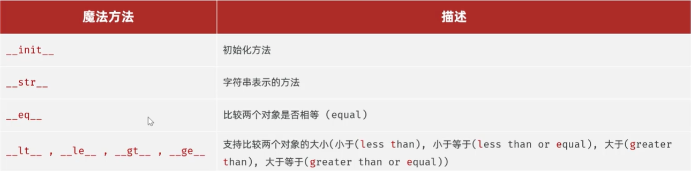

## 类与对象
### 类的定义
#### 命名规范
- **大驼峰命名法** ：每个单词首字母大写，单词之间无间隔符号
#### 命名语法
**动态添加属性（不推荐）**
```
# 定义类 
class 类名: 
	pass 
# 创建对象 
对象名 = 类名() 
对象名.属性名1 = 属性值1 
对象名.属性名2 = 属性值2 
print(c1.__dict__)
```
- 提示：__ dict __ 是Python中对象的一个特殊属性，以字典的形式储存对象的全部属性
- 如果直接输出对象 `print(c1)`，则输出的是对象的内存地址
**定义时指定属性 (推荐)**
```
class 类名:
    def __init__(self, 参数列表):
        self.属性名 = 参数值
        self.属性名 = 参数值

# 创建对象
对象名 = 类名(参数列表)
-----------------------------------------------------------------------------
class Car:
    def __init__(self, c_brand, c_name, c_price):
        self.brand = c_brand
        self.name = c_name
        self.price = c_price

c1 = Car("BMW", "X5", 500000)
print(c1.__dict__)
```
- **__init__**：
	- 初始化方法，**创建对象的时候，会自动调用**
	- 作用：给对象设置初始属性、初始化对象状态
- **self** ：
	- 方法的第一个参数,表示当前创建的实例对象，不需要自己传
### 方法的定义
#### 定义语法
```
class 类名:
    def __init__(self, 形参列表):
        self.属性名 = 参数值
        self.属性名 = 参数值

    # 实例方法，第一个参数必须是self
    def 方法名(self, 形参列表):
        ...

    def 方法名(self, 形参列表):
        ...
# 创建对象
对象名 = 类名(参数列表)
对象名.方法名(实参)   # 调用实例方法，不用传self
-----------------------------------------------------------------------------
class Car:
    def __init__(self, brand, name, price):
        self.brand = brand
        self.name = name
        self.price = price

    # 实例方法1
    def running(self):
        print(f"{self.brand} {self.name} 正在高速行驶...")

    # 实例方法2，除self外还有别的参数
    def total_cost(self, discount, rate):
        return self.price * discount + self.price * rate

# 创建对象
c1 = Car("BMW", "X5", 500000)

# 调用实例方法，不用给self传参
c1.running()
total_price = c1.total_cost(0.9, 0.1)
print(f"提车总价为: {total_price:.0f}")
```
- **注意** ：def定义在类外部时称为**函数**；定义在类内部时称为**方法**，定义方法和函数相同，只是多一个形参**self**表示当前对象，调用时不需要传递
#### 魔法方法
- 魔法方法是指Python中提供的以**双下划线开头和结尾**的特殊方法,用于定义类的特殊行为
- 只需要定义，不需要手动调用，python会自动调用

- **\_\_str\_\_:** 相当于java里的toString，可以把对象的属性按指定格式输出，定义之后使用`print(c1)`就不会输出地址
```
	def __str__(self):  
	    return f"{self.color}-{self.brand}-{self.name}-{self.price}"
-----------------------------------------------------------------------------
```

