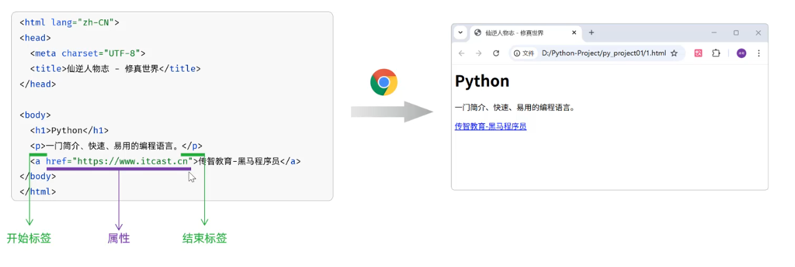
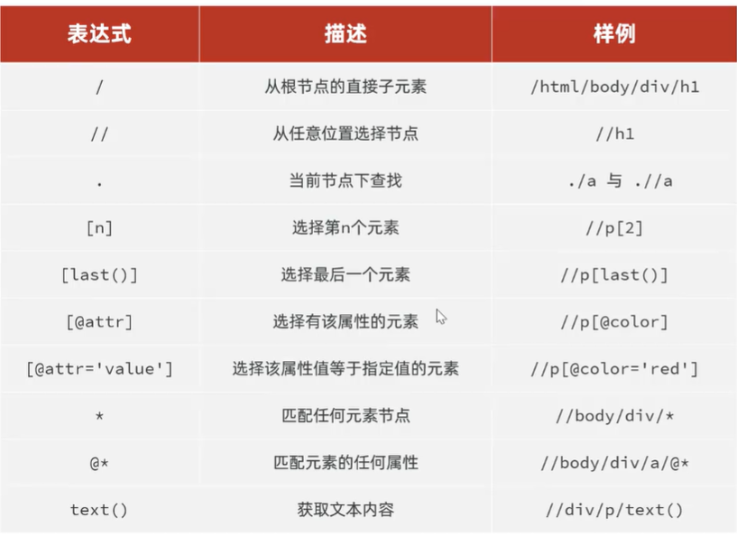

# 网络爬虫基础

## 1. 什么是网络爬虫

- 也称为网络爬虫（网络机器人），是一种按照一定的预设规则，自动浏览并抓取网络数据的程序或脚本。

网络请求相关概念可以先查看[[Web网络基础]]。

## 2. 使用Requests获取网页

Requests库可以让Python程序方便地发送HTTP请求。
```python
# 导入Requests库
import requests

# 定义URL
target_url = "https://www.tiobe.com/tiobe-index/"

# 发送请求，获取数据
response = requests.get(url=target_url)

# 返回数据（还未解析，是HTML格式的字符串）
print(response.text)
```

## 3. 爬虫需要了解的网页结构

● 一个网页是由三个部分组成的,分别是:HTML、CSS、JS(JavaScript)。

· HTML:超文本标记语言,由一堆预设的标签<\h1> 一级标题 <\/h1>构成。HTML负责网页的结构(页面元素和内容)

· CSS:层叠样式表。CSS负责网页的表现(页面元素的外观、位置等样式,如颜色、大小等)

· JS:全称为JavaScript,简称JS。负责网页的行为(交互效果)

所以，爬虫首先需要获取HTML内容。

● HTML(HyperText Markup Language):超文本标记语言。

>超文本:超越了文本的限制,比普通文本更强大。除了文字信息,还可以定义图片、音频、视频等内容。

>标记语言:由标签“<标签名>”构成的语言

· HTML标签都是预定义好的。例如：使用`<h1>`展示标题，使用``展示图片，使用`<video>`展示视频。

· HTML代码直接在浏览器中运行,HTML标签由浏览器解析。

## 4. 使用lxml解析网页
● 网页解析指的是从原始HTML文档中提取数据的过程,也是网络爬虫的关键步骤,从一堆标签文本中提取出需要的数据。
### 4.1 网页解析入门

● lxml:是一个高性能的HTML/XML文档的解析库,支持基于Xpath语法来解析和获取网页数据。
● 安装：

```bash
pip install lxml
```

```python
from lxml import html

with open("resources/仙逆人物志.html","r",encoding="utf-8")as f:
    html_content = f.read()

# 解析网页内容
doc = html.fromstring(html_content)
th_list = doc.xpath("//table/thead/tr[1]/th/text()")
print(th_list)

td_list = doc.xpath("//table/tbody/tr[1]/td/text()")
print(td_list)
```

Xpath:是一种用于在HTML/XML文档中导航或定位元素的查询语言,让你能够准确的定位文档中的特定元素、属性或文本。

